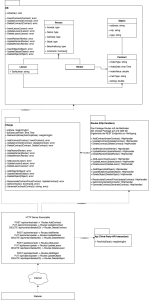

# Solution Design

## 1. Standards und Technologien
### 1.1 Rücksprache mit Auftraggeber
Der Auftraggeber stellte die Anforderung, dass das Backend in ASP.NET und das Frontend in VUE.JS v3.2.30 entwickelt werden muss.  
Nach Rücksprache mit dem Auftraggeber dürfen wir nun selbst entscheiden, welche Standards wir verwenden, weil keine enge Integration in bereits bestehende Applikationen notwendig ist.

### 1.2 Backend
Das Backend wird mit Go Version 1.17.6 umgesetzt.   
Das Backend wird als JSON-REST-API umgesetzt.      
Für das Backend sind die Implementierungsrichtlinien der [Waterbyte-CLEAN-Architecture](https://github.com/Engelbyte-s-Waterbyte/waterbyte-clean-architecture) einzuhalten.   
Für die Datenbank-Interaktion wird ein [ORM](https://gorm.io) verwendet v1.22.5 -> Database first.
Für Gorm verwenden wir den SQLLite Connector [https://github.com/go-gorm/sqlite](https://github.com/go-gorm/sqlite) v1.2.6

#### 1.2.1 Datenbank
Für die Datenbank werden wir SQLite v3.37.2 verwenden.

### 1.3 Frontend
Für das Frontend haben wir uns für VUE.JS Version 3.2.28 entschieden. 

#### 1.3.1 UI/UX 
Das User-Interface wird gemäß den Mockups in der Anforderungsspezifikation erstellt.
Dabei wurden bereits alle Anmerkungen des Kunden berücksichtigt.

## 2. Dokumentation 
Die Dokumentation beschränkt sich auf die im Rahmen des SYP-Unterrichts angefertigten Dokumente (Anforderungsspezifikation, Solution-Design).

Für die grafische Modellierung verwenden wir draw.io.

Dokumente und Projekte werden über Git bzw. Github verwaltet.

<!-- Die Dokumentation verfügt einen Detailierungsgrad von 3. -->

### 3. Aufteilung der Arbeit und Code-Verwaltung
Die Aufteilung der Arbeit erfolgt über Clickup bzw Github.    
Die Versionsverwaltung des Projektes erfolgt über Github bzw Git.

## Solution-Modellierung
### Klassen(UI,Geschäftsobjekte,Datenobjekte)

<!-- 
#### UI

#### Geschäftsobjekte

#### Datenobjekte -->

Bei der Modellierung der Klassen wurden die SOLID-Prinzipien berücksichtigt.
 
<!-- Die Software soll nach dem Chill-Prinzip aufgebaut werden. -->
<!-- Falls Fehler aufkommen sollten die Benutzer diese mit Details was genau passiert ist an Waterbyte senden. -->

## Sequenzen

<!-- ## Allgemein -->

## Software Architektur
Das System wird als Server-Client-Architektur umgesetzt. Die verwendeten Technologien wurden in 1. festgelegt.   
Das gesamte System soll in einem Docker-Container funktionieren, auf Port 80 des Docker-Containers soll die Website aufzurufen sein.   
Docker-Container:
- Image: [Nginx](https://hub.docker.com/_/nginx)
Im Docker Container läuft:
- das Backend:
    - binäre Datei, die mit `go build` erzeugt wurde
    - stellt API unter Port 3333 zur Verfügung
- NGINX Server
    - Port 80
    - statischer Fileserver, der die mit `vue build` generierten Dateien hostet
    - proxy: Requests, deren Route mit /api beginnt, werden an den Backend Server weitergeleitet

### Daten
Die Daten werden in einer SqlLite-Datenbank (Version 3) gespeichert.

## Deployment

Es wird ein Skript (deployment.sh) bereitgestellt, das chronologisch abarbeitet:

## Security
Die finale Website soll nur über https erreichbar sein.

## Technologie-Stack
Siehe Punkt 1.

## Persistierung
Siehe Punkt 1.

### Anhang
## Umsetzungskonzept NF-Anforderungen
Das User-Interface wird gemäß den Mockups in der Anforderungsspezifikation erstellt.   
Um eine möglichst schnelle Reaktion des Backends zu gewährleisten wurde der Standard Go gewählt.

## Standard-Beschreibung
Normal bruder

### Qualitätssicherung

## 1.1 Klassen

## 1.2 Testen
Modul-Tests und Unit-Tests werden im Anschluss an das Solution-Design erstellt, danach werden Entwicklungspakete inkl. Verifikation (Tests) auf die Projektmitarbeiter aufgeteilt. (Test-Driven-Development)
